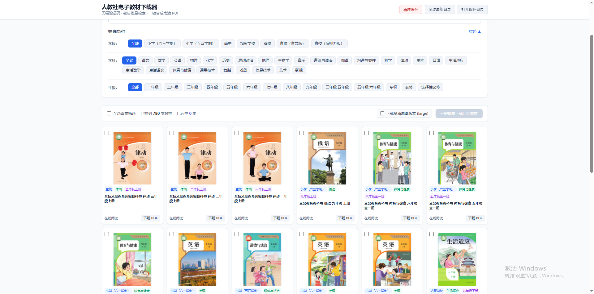

# 人教社电子教材下载器

[](https://opensource.org/licenses/MIT)
## <div align="center"><b><a href="README_EN.md">English</a> | <a href="README.md">简体中文</a></b></div>

一款针对[人民教育出版社中小学电子教材平台](https://jc.pep.com.cn/)开发的自动化教材获取与 PDF 合成工具。

内置全量 780+ 本教材目录（本地加密数据自动解密）与 WAF 滑块验证自动通过机制，支持指定学段、学科、年级批量下载教材切片并自动合成为 PDF 文件。

> **二次开发声明**：本项目基于 [siknet/FreePEP](https://github.com/siknet/FreePEP) 二次开发，在原项目基础上重构了 WebUI 界面并新增切片在线阅读等能力，感谢原作者的出色工作。原项目与本项目均与人民教育出版社无任何关联。

## 📸 界面预览



## ✨ 功能特性

### WebUI 网页端（`python webui.py`）
- **层级筛选**：学段 / 学科 / 年级三级筛选，筛选面板支持折叠收起
- **关键词搜索**：全局搜索书名，与筛选条件叠加使用
- **封面预览**：点击教材封面放大查看，滚轮缩放，双击还原
- **在线阅读**：由服务端 Playwright 中转拉取教材切片，页内直接翻阅浏览，首次打开约 30-60 秒，之后秒开
- **批量下载**：复选框勾选一键批量下载，实时进度展示，支持高清原图版本（large）
- **分页浏览**：每页条数可选（20/50/100/200），大数据量区域内部滚动
- **缓存管理**：一键清理临时切片缓存、同步最新教材目录、快捷打开下载目录

### CLI 命令行（`python cli.py`）
- 交互式数字菜单导航与命令行参数直达两种模式，适合脚本集成与服务器环境

### 全量归档下载（`python download_all.py`）
- 多线程并发下载，按「学段 / 年级」两层目录自动归档
- 智能断点续传：已下载教材自动跳过，中断后可无缝继续
- PDF 合成后自动清理切片缓存，节约磁盘空间

---

## 🚀 使用方式

### 方式一：从源码启动

```bash
# 克隆仓库
git clone https://github.com/zhuzhao9527/FreePEP.git
cd FreePEP

# 安装 Python 依赖
pip install -r requirements.txt

# 安装 Playwright 所需的 Chromium 浏览器内核
playwright install chromium
```

#### 启动 WebUI
```bash
python webui.py
```
- 访问地址：`http://127.0.0.1:8000`
- 默认下载目录：项目根目录下的 `./downloads` 文件夹

#### 使用 CLI 命令行
```bash
# 1. 交互式菜单模式
python cli.py

# 2. 下载小学一年级的所有学科教材
python cli.py --xd "小学" --nj "一年级" -y

# 3. 下载高中数学的所有必修/选修教材
python cli.py --xd "高中" --xk "数学" -y

# 4. 全局关键词搜索并下载
python cli.py --search "物理"

# 5. 清理本地临时图片缓存
python cli.py --clear-cache
```

**参数说明**：

| 参数 | 说明 | 示例 |
| :--- | :--- | :--- |
| `--xd` | 指定学段 | `小学（六三学制）`、`初中（七-九年级）`、`高中`、`培智学校`、`聋校`、`盲校（盲文版）`、`盲校（低视力版）` |
| `--xk` | 指定学科 | `语文`、`数学`、`英语`、`物理`、`化学`、`历史`、`道德与法治` 等 |
| `--nj` | 指定年级/册次 | `一年级`、`二年级` ... `九年级`、`专项`、`必修` 等 |
| `--search`, `-s` | 关键词全局搜索 | `必修`、`高一`、`地理` |
| `--high-res`, `--hd` | 下载高清原图版本 (`large`)，默认普通版本 (`mobile`) | 无需参数 |
| `--clear-cache`, `-c` | 清理本地下载临时图片缓存 (`temp_pages`) | 无需参数 |
| `--refresh`, `-r` | 强制重新从官方服务器拉取解密最新目录 | 无需参数 |
| `--output`, `-o` | 指定 PDF 保存目录 | 默认: `./downloads` |
| `--yes`, `-y` | 跳过确认提示直接开始下载 | 开启免交互 |

#### 全量多线程归档下载
```bash
# 一键下载全量教材（默认 3 线程并发，按「学段/年级」自动归档）
python download_all.py

# 自定义线程数与学段组合
python download_all.py --xd "小学（六三学制）,初中（七-九年级）,高中" -w 10 -o "D:/人教社教材"
```

### 方式二：打包为 Windows 独立 EXE

```bash
python build_exe.py
```

打包脚本自动完成：
1. 检查并安装 `PyInstaller` 编译工具
2. 将 WebUI 及所有依赖打包为独立可执行文件 `FreePEP.exe`
3. 自动提取并内嵌绿色便携版 Chromium 浏览器内核至 `browsers/` 目录
4. 在 `dist/` 目录生成发行压缩包，解压后双击 `FreePEP.exe` 即可直接使用

---

## 📁 项目目录结构

```text
FreeNow/
├── pep_core.py          # 核心底层库（AES 解密、Playwright 爬取、PDF 合成）
├── webui.py             # FastAPI WebUI 服务器与一体化前端界面
├── cli.py               # 交互式与参数化 CLI 终端下载器
├── download_all.py      # 按「学段/年级」层级全量下载脚本（支持断点续传与缓存清理）
├── build_exe.py         # 一键打包发布 Windows EXE 独立便携包脚本
├── pep_crawler.py       # 命令行测试与示例下载脚本
├── pep_catalog.json     # 全量教材元数据本地缓存（自动生成）
├── requirements.txt     # 项目 Python 依赖清单
├── temp_pages/          # 图片下载临时缓存目录（在线阅读切片与下载中间产物）
└── downloads/           # 生成的 PDF 默认存放目录
```

---

## ❓ 疑难解答 (FAQ)

### Q: 在线阅读首次打开很慢？
正常现象。首次打开需由服务端 Playwright 过盾并拉取全部切片（约 30-60 秒），之后该书命中本地缓存秒开。

### Q: 点击下载后 `downloads` 目录没有 PDF 文件？
后台下载依赖 Playwright 驱动的无头 Chromium。若仅执行了 `pip install -r requirements.txt` 而漏装浏览器内核，会抛出 `Executable doesn't exist` 错误。执行以下命令补全安装：
```bash
playwright install chromium
```
> 排查提示：查看运行 `python webui.py` 的终端控制台输出，观察详细异常信息。

---

## ⚠️ 免责声明 (Disclaimer)

1. 本项目仅供爬虫技术交流、逆向工程学习与个人学习研究使用，严禁用于任何商业用途或盈利活动。
2. 本项目下载的所有教材版权均归**人民教育出版社（PEP）**及相关版权所有方所有。本项目与人民教育出版社无任何关联，未经官方授权。
3. 请控制请求频率，严禁进行任何可能对官方服务器造成过大负载的行为。请于下载后 24 小时内自行删除，如需长期使用请购买或支持官方正版出版物。
4. 本项目基于 [siknet/FreePEP](https://github.com/siknet/FreePEP) 二次开发，按 MIT 协议以现状提供，**不提供任何明示或暗示的担保**。原作者与本二次开发作者均不对因使用本项目而产生的任何直接或间接损失承担责任。
5. 使用者因违反版权或不当使用造成的一切法律纠纷与责任，均由使用者个人自行承担，与本项目原作者及二次开发作者无关。

---

## 📄 开源许可

本项目基于 [MIT License](LICENSE) 协议开源。
